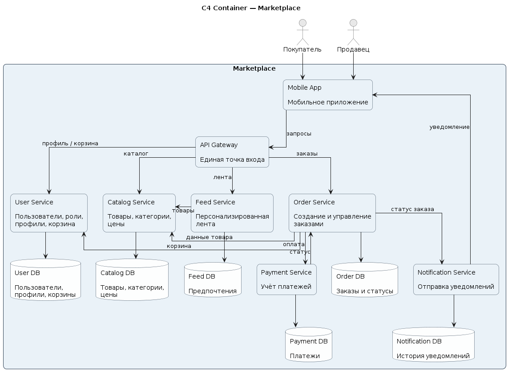

## 1. C4 Container диаграмма



На диаграмме показаны основные части системы:

| Контейнер | Назначение |
|---|---|
| Mobile App | Приложение покупателей и продавцов |
| API Gateway | Единая точка входа в backend |
| User Service | Работа с пользователями, ролями и профилями |
| Catalog Service | Управление товарами, категориями и ценами |
| Feed Service | Формирование персонализированной ленты |
| Order Service | Создание заказов и управление их статусами |
| Payment Service | Учёт платежей и их статусов |
| Notification Service | Отправка уведомлений |
| Databases | Отдельные хранилища для каждого сервиса |

## 2. Docker

В рамках задания реализован минимальный `Catalog Service`.

Бизнес-логика в сервисе отсутствует.

Сервис предоставляет health-check endpoint:

```text
GET /health
```

### Запуск

Для запуска требуется установленный Docker.

Из корня проекта выполнить:

```bash
docker compose up --build
```

После запуска проверить health-check:

```bash
curl -i http://localhost:8080/health
```

Ожидаемый результат:

```text
HTTP/1.1 200 OK
```

и тело ответа:

```json
{
  "status": "ok"
}
```

> Если в `docker-compose.yml` используется другой внешний порт, необходимо указать его вместо `8080`.

---

## 3. Домены и их ответственность

В маркетплейсе выделены следующие домены.

### User

Отвечает за:

- пользователей
- роли `buyer` и `seller`
- профили
- данные корзины

### Catalog

Отвечает за:

- товары
- категории
- цены
- данные карточек товаров
- управление каталогом со стороны продавца

### Feed

Отвечает за:

- формирование товарной ленты
- персонализацию выдачи
- хранение пользовательских предпочтений

### Order

Отвечает за:

- создание заказа
- состав заказа
- изменение статуса заказа
- жизненный цикл заказа

### Payment

Отвечает за:

- создание платежа
- учёт платежных операций
- хранение статуса оплаты

### Notification

Отвечает за:

- формирование уведомлений
- отправку уведомлений о статусах заказа
- хранение истории отправленных уведомлений

---

## 4. Распределение доменов по сервисам

Каждый основной бизнес-домен выделен в отдельный сервис.

| Домен | Сервис |
|---|---|
| User | User Service |
| Catalog | Catalog Service |
| Feed | Feed Service |
| Order | Order Service |
| Payment | Payment Service |
| Notification | Notification Service |

Такое разбиение было получено следующим образом:

Согласо ТЗ я выделил домены, а потом решил для каждого домена сделать свой сервис, который будет отвечать за логику связанную с этим доменом

## 5. Владение данными и взаимодействия сервисов

Каждый сервис является единственным владельцем своих данных.

Разделяемые базы данных между сервисами отсутствуют.

| Сервис | Владеет данными |
|---|---|
| User Service | Пользователи, роли, профили, корзина |
| Catalog Service | Товары, категории, цены |
| Feed Service | Пользовательские предпочтения |
| Order Service | Заказы, позиции заказов, статусы |
| Payment Service | Платежи и статусы оплаты |
| Notification Service | История уведомлений |

### Синхронные взаимодействия

| Откуда | Куда | Назначение |
|---|---|---|
| Mobile App | API Gateway | Запросы пользователя |
| API Gateway | User Service | Работа с профилем |
| API Gateway | Catalog Service | Работа с каталогом |
| API Gateway | Feed Service | Получение ленты |
| API Gateway | Order Service | Работа с заказами |
| Feed Service | Catalog Service | Получение данных о товарах |
| Order Service | Catalog Service | Получение данных товара для заказа |
| Order Service | Payment Service | Инициация оплаты |
| Order Service | User Service | Получение содержимого корзины при оформлении заказа |

### Асинхронные взаимодействия

| Откуда | Куда | Назначение |
|---|---|---|
| Payment Service | Order Service | Передача изменения статуса оплаты |
| Order Service | Notification Service | Передача изменения статуса заказа |

## 6. Альтернативные варианты декомпозиции

При проектировании рассматривались два варианта архитектуры.


### Вариант 1 — модульный монолит

Все бизнес-домены находятся внутри одного backend-приложения, при этом код разделён на отдельные модули

### Вариант 2 — микросервисная архитектура

Каждый основной домен выделяется в отдельный сервис

### Вариант 3 — Распределенный монолит

Сервисов много, но они жестко связаны между собой

## 7. Trade-off'ы вариантов

### Вариант 1 — модульный монолит

#### Плюсы

- проще разработка
- меньше инфраструктуры
- отсутствуют сетевые вызовы между внутренними модулями
- проще мониторинг и отладка

#### Минусы

- сложнее независимо масштабировать отдельные части системы
- все модули разворачиваются одновременно
- изменение одного модуля может потребовать развёртывания всего приложения
- хуже надежность

### Вариант 2 — микросервисная архитектура

#### Плюсы

- чёткие границы ответственности
- независимое владение данными
- независимое развёртывание сервисов
- возможность независимо масштабировать отдельные части системы
- отказ одного сервиса не обязательно приводит к полной недоступности системы

#### Минусы

- выше инфраструктурная сложность
- взаимодействие происходит по сети, появляются сетевые ошибки и задержки
- сложнее обеспечивать согласованность данных
- усложняется мониторинг и диагностика
- сложнее операции, затрагивающие несколько сервисов
- необходимо поддерживать совместимость API и межсервисных контрактов

### Вариант 3 — Распределенный монолит

Вобрал в себя минусы обоих вариантов, сразу отметаем

## 8. Финальный выбор архитектуры

В качестве целевой архитектуры выбрана микросервисная архитектура с декомпозицией по бизнес-доменам.

Такой вариант выбран потому, что он позволяет:

- явно определить границы бизнес-доменов
- определить владельца каждого типа данных
- независимо развивать отдельные части системы
- независимо масштабировать сервисы с разной нагрузкой
- изолировать изменения в разных бизнес-областях

При этом микросервисная архитектура имеет более высокую инфраструктурную сложность.

Для небольшого проекта модульный монолит мог бы быть более простым и дешёвым решением.
